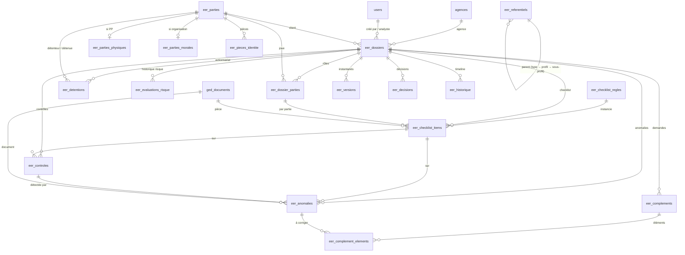

# EER — Architecture métier (étape 2, à valider avant migrations)

Module `eer` — Conformité → KYC → Gestion des Entrées en Relation.
Statut : **proposition**. Aucune table EER n’est créée tant que ce document et
[eer-matrices.md](eer-matrices.md) ne sont pas validés.

## 0. Sources et niveau de certitude

| Repère | Source | Contenu réel |
|--------|--------|--------------|
| **[CDC §n]** | `Cahier-charge-gestion-ouverture-compte.docx` (Bureau, 01/10/2026) | Cahier des charges **général** (46 sections) : dossier, contrôles PI, checklist, PPE, FATCA, LBC-FT, mandataires, actionnariat 4 niveaux, BE 10 %, tranches, workflow proposé, rôles, reporting, GED, audit. **Ne contient pas les fiches détaillées** (aucune annexe, image ou objet incorporé). |
| **[FICHES]** | 7 PDF interactifs officiels BEA (racine du dépôt, non versionnés) : fiche client Personne physique, PM privée, PM publique, PM associations, Mandataire, Fiche actionnaire personne morale, Spécimen de signature | **Source de référence des champs** (texte + champs de formulaire extraits le 04/10/2026). Détail : [eer-matrices.md §0](eer-matrices.md#0-apports-des-fiches-officielles). |
| **[XLS]** | `Suivi-entre-en-relation.xlsx` | Feuil1 : 16 colonnes, 1 ligne de données. Feuil2 : conformité par agence / profil / état du compte via `[1]FLUX!`. |
| **[PROP]** | Proposition d’architecture | Choix techniques, à valider. |
| **[À CONFIRMER]** | — | Information absente des sources : **pas de valeur inventée**, paramètre vide ou question ouverte (§25). |

## 0 bis. Cycle métier réel (référence, décision du 04/10/2026)

Le module est construit autour de ce cycle, pas autour d’un formulaire Excel :

```text
CHARGÉ CLIENTÈLE / CHARGÉ D'AFFAIRES
  1. reçoit le client, récupère pièces et informations
  2. crée le dossier EER, saisit les informations connues
  3. scanne et ajoute les documents
  4. soumet à la Conformité
AGENT CONFORMITÉ
  5. reçoit / ouvre le dossier, consulte les documents
  6. GÉNÉRATION DE LA CHECKLIST à partir des données du dossier
     (type, profil, sous-profil, type de compte, PPE, FATCA, mandataire, risque…)
  7. coche les éléments disponibles, laisse les manquants non cochés
  8. VALIDATION DE LA CHECKLIST
  9. ouverture des FICHES KYC adaptées, PRÉ-REMPLIES avec les données déjà connues
 10. complète UNIQUEMENT ce qui manque / confirme ce qui doit l'être
 11. contrôles → MOTEUR DE CONFORMITÉ
       CONFORME     → AVIS KYC (si requis) → DÉCISION D'OUVERTURE
       NON CONFORME → anomalies → complément → retour du client
                      → MÊME DOSSIER, reprise au point d'arrêt
```

Règles structurantes :

1. **Le dossier est créé avant la checklist** ; il est la source centrale.
2. **Une information métier n’est saisie et stockée qu’une fois** (ex. date de naissance
   dans la partie client). Dossier, checklist, fiches, résumé, reporting, PDF et archive
   l’**affichent** ; ils ne la recopient pas. Les fiches KYC sont des **vues** sur les
   données (§6 bis), pas des copies.
3. La checklist couvre **documents, informations et contrôles**, pas seulement des pièces.
4. Les pièces justificatives exactes par profil sont **du paramétrage** (`eer_checklist_regles`),
   pas du code : la liste officielle sera saisie quand elle sera récupérée, sans refaire le module.
5. Une non-conformité ne crée jamais un nouvel EER : `EER-2026-000123` reste le même,
   versions 1, 2, 3… ; les données courantes restent directement accessibles.

Décisions du 04/10/2026 :

| Sujet | Décision |
|-------|----------|
| Création du dossier | **Chargé clientèle / chargé d’affaires** (remplace la décision précédente « agent conformité ») ; l’agent conformité peut créer pour le compte d’une agence (repli paramétrable). Rôle à ajouter : `eer.charge` (périmètre : son agence). |
| Type d’opération | `operation_type` = `ENTREE_RELATION` (V1) / `MISE_A_JOUR` (prévu, désactivé en V1) — conforme au « Motif de la fiche » officiel. |
| Dossier jamais régularisé | `A_COMPLETER` + relances (compteur, date de dernière relance) ; état `ABANDONNE` avec motif (ex. « Complément non reçu ») ; jamais supprimé, conservé dans l’historique et les statistiques. |
| Pièces par profil | Non bloquant : configurables dans les règles de checklist. |
| Type de compte | Nouveau fait du moteur (`type_compte`) ; référentiel vide à paramétrer. |
| Séparation des rôles | Créateur (chargé) ≠ contrôleur ≠ auteur de l’avis / de la validation (paramétrable). |

### Phasage

| Phase | Contenu |
|-------|---------|
| **A — maintenant** | modèle EER, dossier client, types/profils, fiches, checklist dynamique, pré-remplissage, documents, contrôles, anomalies, moteur de conformité, visas, mandataires, actionnaires, BE, PPE/FATCA, risque, compléments, historique, workflow, audit |
| **B — ensuite** | reporting Excel, CONFORMITÉ DU FLUX, analyse `[1]FLUX`, reprise des anciennes règles, import éventuel de l’historique Excel |
| **C — finalisation** | RLS, permissions, GED, notifications, dashboard, PDF/Excel/CSV, tests, migrations Alembic, non-régression |

Le cœur métier de la phase A est écrit en Python pur (`backend/app/services/eer/`),
testé sans base ; la persistance s’appuie ensuite sur le modèle §3.

| Module | Rôle |
|--------|------|
| `conditions.py` | Conditions JSON des règles (validation, évaluation, explication) — aucun code exécuté |
| `faits.py` | Faits du dossier ; PPE/FATCA du client et du mandataire uniquement ; risque imposé ; `avis_requis` (§5.2) |
| `checklist_engine.py` | Génération (portée DOSSIER / PARTIE), régénération sans suppression, pointage (présence), contrôle (conformité) |
| `prefill.py` | Fiches = vues sur la donnée unique ; états CONNU / MANQUANT / A_CONFIRMER / CONFIRME / NON_APPLICABLE |
| `beneficiaires.py` | Structure d’actionnariat (cycles, totaux, PM sans actionnaires) ; BE = Σ produits des % ; % inconnu → A_VERIFIER |
| `conformite_engine.py` | Décision par axe + globale expliquée ; propositions d’anomalies |
| `workflow.py` | Transitions, permissions, séparation des rôles, étapes internes, reprise, relance, abandon |

Référentiel initial : `backend/app/data/eer_referentiel.py` (valeurs des fiches uniquement).
Persistance : `backend/app/services/eer_dossier_service.py` (cycle complet, permissions vérifiées
côté service, historique + audit CORE sans données personnelles, versions SHA-256).
Tests : `backend/tests/test_eer_engine.py` (sans base), `backend/tests/test_eer_dossier_service.py`
(PostgreSQL, ignorés tant que les migrations EER ne sont pas appliquées).

## 1. Modèle métier

Principe : **un moteur EER central**, pas un formulaire par type de client.

```text
                 EER (dossier unique, EER-AAAA-NNNNNN)
                  │
   ┌──────────────┼───────────────────────────────┐
   │              │                               │
 CONTEXTE       PARTIES (référentiel unique)     MOTEUR
 type client    ┌─ client (PP ou organisation)    faits du dossier
 profil         ├─ mandataires / procurations      ↓ règles (condition)
 sous-profil    ├─ signataires                    checklist générée
 agence         ├─ dirigeants / membres direction  ↓
 paramètres     ├─ actionnaires (graphe N niveaux) contrôles auto + manuels
                ├─ bénéficiaires effectifs (calc.) ↓
                └─ contacts d’urgence             anomalies
                                                   ↓
                                                  décision (physique + système)
                                                   ↓
                                                  workflow / avis KYC
```

Concepts :

1. **Dossier EER** — l’entrée en relation : agence, type client, profil, sous-profil,
   mouvements, origine/destination des fonds, risque, état du compte, analyste, statut.
2. **Partie** — toute personne physique ou organisation intervenant dans un dossier
   (client, mandataire, signataire, actionnaire, BE, dirigeant, contact d’urgence).
   Une **seule** structure : un mandataire déjà connu est réutilisé, pas ressaisi [FICHES].
3. **Rôle dans le dossier** — lien dossier ↔ partie avec ses attributs propres
   (type de mandat, comptes avec mandat, fonction, PPE, FATCA, risque, avis).
4. **Détention** — arête « A détient x % de B » ; l’actionnariat est un graphe sans
   limite de niveau (les niveaux 1→4 des fiches sont *calculés*) [CDC §20].
5. **Règle de checklist** — condition sur les faits du dossier → élément de checklist.
6. **Élément de checklist** — instance d’une règle pour un dossier (et éventuellement
   une partie), avec **présence** et **statut de conformité** distincts.
7. **Contrôle** — exécution (automatique ou analyste) qui produit un résultat expliqué.
8. **Anomalie** — non-conformité tracée, liée à un document, un champ, un contrôle,
   un élément de checklist ou au dossier.
9. **Complément** — demande groupée d’éléments manquants ; la **reprise** se fait
   sur le même dossier, version + 1.
10. **Version** — instantané immuable du dossier à chaque soumission / décision.
11. **Décision** — conformité physique, conformité système, décision globale + explication.

## 2. Diagramme des relations



## 3. Nouvelles tables (22 tables physiques)

Les 18 lignes ci-dessous regroupent 22 tables (`eer_complements` + `eer_complement_elements`,
versions / décisions / historique, plus `eer_champs_etat` du §6 bis). Modèles :
`backend/app/models/eer.py`.

| # | Table | Rôle |
|---|-------|------|
| 1 | `eer_referentiels` | Listes paramétrables (domaine, code, libellé, parent, ordre, actif, `meta` jsonb) : types client, profils, sous-profils, types de pièce, types de document, tranches de mouvements, types de mandat, types de contrat, situations matrimoniales, états du compte, types/gravités d’anomalie, motifs PPE, indices FATCA… |
| 2 | `eer_parametres` | Paramètres KYC versionnés par date d’effet (code, valeur jsonb, description, validé par, `date_effet`) : seuil BE, délai « expiration proche », séparation des rôles, portée agence… |
| 3 | `eer_reference_compteurs` | Compteur annuel verrouillé (`SELECT … FOR UPDATE`) pour `EER-AAAA-NNNNNN` — évite le `count()+1` (course entre deux créations). |
| 4 | `eer_parties` | Partie commune : nature (`PHYSIQUE`/`MORALE`), nom ou raison sociale, nationalité / pays, résidence, adresse, téléphones, email, `racine_client` ORION (nullable). |
| 5 | `eer_parties_physiques` | 1-1 : prénom, prénom du père, sexe, date/lieu de naissance, situation matrimoniale, profession, employeur, salaire net, date d’embauche, type de contrat. |
| 6 | `eer_parties_morales` | 1-1 : forme/catégorie, date de création, activité, siège, effectif, RC chronologique, RC analytique, NIF, résidence fiscale, site web, n° d’agrément, impact RSE, domaines RSE. |
| 7 | `eer_pieces_identite` | Type (NNI, carte de séjour, carte diplomatique, passeport), numéro, délivrance, expiration, pays émetteur ; unicité (type, numéro, pays) → réutilisation d’une partie existante. |
| 8 | `eer_dossiers` | Le dossier (voir §3.1). |
| 9 | `eer_dossier_parties` | Rôle d’une partie dans un dossier + attributs (voir §3.2). |
| 10 | `eer_detentions` | Arêtes du graphe d’actionnariat : détenteur → détenue, pourcentage, mode, lien. |
| 11 | `eer_evaluations_risque` | Historique LBC-FT : niveau, facteurs (profil, produits/services, zone), justification, analyste, date, validation [CDC §17]. |
| 12 | `eer_checklist_regles` | Règles du moteur, versionnées (§6). |
| 13 | `eer_checklist_items` | Checklist d’un dossier (§6). |
| 14 | `eer_controles` | Résultats de contrôles auto/manuels, détail jsonb. |
| 15 | `eer_anomalies` | Anomalies (§18). |
| 16 | `eer_complements` + `eer_complement_elements` | Demandes de complément et éléments ciblés (§19). |
| 17 | `eer_versions`, `eer_decisions`, `eer_historique` | Instantanés immuables, décisions expliquées, timeline des transitions. |
| 18 | `eer_visas` | Tableau des signataires (visas et avis internes), §3.3. |

### 3.1 `eer_dossiers` (colonnes clés)

`id`, `reference` (unique), `agence_id`, `type_client_code`, `profil_code`,
`sous_profil_code` (nullable), `client_partie_id`, `racine_client` (nullable, ORION),
`numero_idp` (PP, PM publique) / `numero_idm` (PM privée, association) [FICHES],
`motif_fiche` (`ENTREE_EN_RELATION` / `MISE_A_JOUR`), `date_eer`,
spécimen : `numero_compte`, `date_ouverture_compte`, `nombre_signataires`,
`type_signature` (`UNIQUE` / `CONJOINTES` / `SEPAREES`) [FICHES],
`tranche_mouvement_code`, `origine_fonds`,
`destination_fonds`, `commentaire_profil`, `risque_lbcft` (dernier niveau validé),
`ppe_dossier` / `fatca_dossier` (calculés, §12-13), `conformite_physique`,
`conformite_systeme`, `decision_globale`, `moment_controle` (`PREALABLE` / `A_POSTERIORI`,
voir [eer-matrices.md §5.1 bis](eer-matrices.md)), `etat_compte` (Actif / Inactif / Bloqué / Fermé [XLS]),
`statut` (workflow), `version_courante`, `analyste_id`, `created_by_id`, `parametres_snapshot` jsonb,
`created_at`, `updated_at`, `archived_at`.

### 3.2 `eer_dossier_parties`

`dossier_id`, `partie_id`, `role` (`CLIENT`, `MANDATAIRE`, `SIGNATAIRE_COMPTE` (spécimen),
`GERANT`, `CO_GERANT`, `SIGNATAIRE_ASSOCIATION`, `CO_SIGNATAIRE_ASSOCIATION`, `MEMBRE_DIRECTION`,
`ACTIONNAIRE`, `BENEFICIAIRE_EFFECTIF`, `CONTACT_URGENCE`),
`type_mandat_code`, `mandataire_social`, `procuration`, `lien_client`, `fonction`,
`comptes_mandat`, `ppe`, `ppe_motif`, `fatca_indice`, `fatca_indices` jsonb,
`risque_lbcft`, `avis_conformite`, `gestionnaire_id`, `responsable_agence_id`,
`be_source` (`CALCULE` / `DECLARE`), `be_pourcentage_calcule`, `ordre`.
Unicité (dossier, partie, rôle). PPE / FATCA / risque ne sont portés **par partie** que
pour le client et les mandataires (seules fiches qui les demandent) [FICHES].

### 3.3 `eer_visas` — « Tableau des signataires » (cadre réservé à la banque)

Le « Tableau des signataires » des fiches (Date, Nom, Fonction, Avis, Signature) est la
**chaîne de visas internes** de la banque, pas les signataires du compte (ceux-ci sont sur
le spécimen). Table `eer_visas` : `dossier_id`, `dossier_partie_id` (nullable : avis sur une
fiche mandataire), `user_id`, `fonction`, `avis`, `commentaire`, `date`. La « signature »
= action authentifiée dans BEA DIGITAL (Login 2), tracée dans l’audit.
Fiche mandataire : gestionnaire du compte, responsable d’agence, puis « Avis du Service
Conformité KYC ». Fonctions attendues et valeurs d’avis : [À CONFIRMER].

## 4. Tables existantes réutilisées (aucune duplication)

| Besoin | Table existante | Usage EER |
|--------|-----------------|-----------|
| Utilisateurs / analystes | `users` (+ `agence_id`) | créateur, analyste, valideur, gestionnaire |
| Agences | `agences` (17 actives, dont les 15 de Feuil2 + AMANTY, ZOUERATE) | `eer_dossiers.agence_id`, portée d’accès |
| Rôles / permissions | `roles`, `permissions`, `role_permissions`, `user_roles` | `eer.*` (existant) + ajouts §16 |
| Accès plateforme | `plateforme_espaces/modules`, `user_*_acces` | Login 1 → département → Login 2 `eer` |
| GED | `ged_documents` (version, `parent_document_id`, `security_level`, OCR, `agence_id`) | `espace_code=audit-controle-conformite`, `module_code=eer`, `entity=eer_dossier`, `entity_id=<dossier>`, `doc_type` = référentiel ; **accès uniquement via `/api/v1/eer/...`** |
| Audit | `audit_logs` (espace, module, avant/après, session, request_id) | chaque action métier (`module_code=eer`) |
| Notifications | `notifications` (`event_type`, `categorie`, `module_code`) | affectation, complément, avis requis, PPE, FATCA, pièce expirée |
| Sessions | `auth_sessions` | Login 2 module |

Non utilisés : `departements` (org immo), tables `mg_*`, `pieces_jointes` / `archive_*` (immo).

## 5. Relations / clés étrangères

| FK | Cible | ON DELETE |
|----|-------|-----------|
| `eer_dossiers.agence_id` | `agences.id` | RESTRICT |
| `eer_dossiers.client_partie_id` | `eer_parties.id` | RESTRICT |
| `eer_dossiers.analyste_id`, `created_by_id` | `users.id` | SET NULL / RESTRICT |
| `eer_parties_physiques.partie_id`, `eer_parties_morales.partie_id`, `eer_pieces_identite.partie_id` | `eer_parties.id` | CASCADE |
| `eer_dossier_parties.dossier_id` | `eer_dossiers.id` | CASCADE |
| `eer_dossier_parties.partie_id` | `eer_parties.id` | RESTRICT |
| `eer_detentions.dossier_id` | `eer_dossiers.id` | CASCADE |
| `eer_detentions.detenteur_partie_id`, `detenue_partie_id` | `eer_parties.id` | RESTRICT (CHECK détenteur ≠ détenue) |
| `eer_checklist_items.regle_id` | `eer_checklist_regles.id` | RESTRICT |
| `eer_checklist_items.dossier_partie_id` | `eer_dossier_parties.id` | CASCADE |
| `eer_checklist_items.document_id`, `eer_anomalies.document_id` | `ged_documents.id` | SET NULL |
| `eer_controles.item_id`, `eer_anomalies.item_id`, `eer_anomalies.controle_id` | items / contrôles | SET NULL |
| `eer_complement_elements.complement_id` | `eer_complements.id` | CASCADE |
| `eer_complement_elements.anomalie_id` / `item_id` | anomalies / items | RESTRICT |
| `eer_versions`, `eer_decisions`, `eer_historique`, `eer_evaluations_risque` `.dossier_id` | `eer_dossiers.id` | RESTRICT (jamais supprimés) |
| Codes (`type_client_code`, `profil_code`, …) | `eer_referentiels` (domaine, code) | contrôlés applicativement + CHECK domaine |

Un dossier n’est **jamais supprimé physiquement** (archivage). Les instantanés et la timeline sont immuables.

## 6. Moteur de checklist

### 6.1 Faits du dossier (entrée du moteur)

`type_client`, `profil`, `sous_profil`, `agence`, `ppe` (client ou toute partie liée),
`fatca_indice`, `risque` (FAIBLE / MOYEN / ELEVE), `a_mandataire`, `nb_mandataires`,
`a_signataires`, `est_personne_morale`, `a_actionnariat`, `nb_niveaux_actionnariat`,
`a_beneficiaire_effectif`, `residence`, `nationalite`, `tranche_mouvement`, `etat_compte`.
Liste extensible ; chaque fait est calculé côté backend à partir des données saisies.

### 6.2 Règle

| Champ | Description |
|-------|-------------|
| `code` | ex. `PP_PIECE_IDENTITE`, `PPE_MOTIF`, `MANDATAIRE_FICHE` |
| `libelle` | texte affiché |
| `categorie` | IDENTITE, DOCUMENTS, KYC, LBC_FT, FATCA, PPE, MANDATAIRES, ACTIONNARIAT, BE, SIGNATAIRES, AVIS |
| `axe` | PHYSIQUE (dossier/documents), SYSTEME (données ORION), COHERENCE |
| `portee` | DOSSIER ou PARTIE (+ rôle visé : un élément par mandataire, par BE…) |
| `obligatoire` | bool |
| `condition` | expression JSON (ci-dessous), **jamais de code exécuté** |
| `ordre` | tri d’affichage |
| `type_controle` | MANUEL, AUTO_PRESENCE, AUTO_EXPIRATION, AUTO_COHERENCE, AUTO_CALCUL |
| `document_type_code` | type GED attendu (si élément documentaire) |
| `version`, `date_effet`, `actif` | une règle modifiée crée une nouvelle version |

Condition (sous-ensemble sûr, évalué en Python) :

```json
{"all": [
  {"fact": "type_client", "op": "in", "value": ["PM_PRIVEE"]},
  {"any": [{"fact": "ppe", "op": "eq", "value": true},
           {"fact": "risque", "op": "in", "value": ["MOYEN", "ELEVE"]}]}
]}
```

Opérateurs : `eq`, `ne`, `in`, `not_in`, `gt`, `gte`, `lt`, `lte`, `exists`, `all`, `any`, `not`.

### 6.3 Génération et régénération

1. À la création et à **chaque changement de fait**, le moteur évalue toutes les règles actives.
2. Nouvelles règles satisfaites → éléments ajoutés (`NON_CONTROLE`).
3. Règles qui ne s’appliquent plus → élément passé `NON_APPLICABLE` avec motif ;
   **jamais supprimé** s’il a déjà été contrôlé.
4. Chaque élément stocke `raison_applicabilite` : les conditions vérifiées
   (ex. « ajouté car PPE = OUI sur le mandataire X »).
5. La version de règle utilisée est figée dans l’élément.

### 6.4 Statuts d’un élément

`NON_CONTROLE`, `EN_COURS`, `CONFORME`, `NON_CONFORME`, `MANQUANT`, `NON_APPLICABLE`, `A_VERIFIER`.

### 6.5 Présence ≠ conformité

Deux champs séparés sur l’élément :
- `presence` : `PRESENT` / `ABSENT` / `SANS_OBJET` ;
- `statut` (ci-dessus) + `motif_non_conformite` (EXPIRE, ILLISIBLE, INCOHERENT,
  INFORMATION_INCORRECTE, MAUVAIS_DOCUMENT, AUTRE — référentiel).

Exemple : pièce d’identité `PRESENT` + expiration dépassée → `NON_CONFORME` / `EXPIRE`.

## 6 bis. Fiches KYC pré-remplies (une seule saisie)

- Une fiche = définition déclarative (sections, champs, chemin vers la donnée source,
  condition d’applicabilité, obligatoire) issue des fiches officielles.
- À l’ouverture, chaque champ est résolu depuis la source unique (dossier, partie client,
  mandataire…) et reçoit un état : `CONNU` (déjà saisi), `MANQUANT`, `A_CONFIRMER`,
  `CONFIRME`, `NON_APPLICABLE`.
- L’agent ne saisit que les champs `MANQUANT` / `A_CONFIRMER` ; la valeur est écrite dans
  la source (pas dans la fiche). Seule la métadonnée de champ (état, source, qui a confirmé,
  quand) est conservée dans `eer_champs_etat` (`dossier_id`, `chemin`, `etat`, `source`,
  `confirme_par`, `confirme_le`).
- Un champ obligatoire `MANQUANT` alimente la checklist (élément de nature INFORMATION).

## 11. Règles de conformité

Calcul par axe, sur les éléments **obligatoires** applicables :

| Résultat axe | Condition |
|--------------|-----------|
| `CONFORME` | tous `CONFORME` (ou `NON_APPLICABLE`) |
| `NON_CONFORME` | au moins un `NON_CONFORME` ou `MANQUANT` |
| `INCOMPLET` | sinon (`NON_CONTROLE`, `EN_COURS`, `A_VERIFIER` restants) — pas de décision possible |

- Axe **physique** = éléments `axe=PHYSIQUE` (colonne Excel « Conformité physique du dossier ») [XLS][CDC §26].
- Axe **système** = éléments `axe=SYSTEME` (« Conformité des données systèmes »).
- Axe **cohérence** (fiche ↔ PI ↔ système) [CDC §27] : ses écarts créent des anomalies
  rattachées à l’axe physique ou système selon la source fautive.
- **Décision globale** : `CONFORME` si physique = système = `CONFORME` **et** aucune
  anomalie `BLOQUANTE` ouverte ; `NON_CONFORME` si un axe est `NON_CONFORME` ;
  sinon pas de décision.
- **Explication** stockée dans `eer_decisions.explication` : liste des éléments et
  anomalies déterminants (code, libellé, statut, motif, partie concernée).
  L’écran de décision affiche cette liste.
- L’analyste peut **déroger** sur une anomalie (statut `ACCEPTEE`) avec justification
  obligatoire, tracée et soumise à la séparation des rôles.

### 11 bis. Deux niveaux de résultat (décision du 05/10/2026)

Chaque dossier porte **deux** résultats, calculés (jamais saisis) et affichés côte à côte :

| Niveau | Règle | Source |
|--------|-------|--------|
| **Référence Excel** | `CONFORME` si physique = système = `CONFORME` ; `NON_CONFORME` si l’un des deux est `NON_CONFORME` ; sinon `NON_EVALUE` | colonnes M / N → S / T du suivi historique |
| **Décision BEA-DIGITAL** | `decision_globale` existante (ajoute cohérence + anomalies bloquantes) ; `INCOMPLET` ou vide → `NON_EVALUE` | moteur `conformite_engine` (inchangé) |

- Indicateurs Excel dérivés : `code_conforme` (S) = 1 ssi référence `CONFORME` ;
  `code_non_conforme` (T) = 1 ssi référence `NON_CONFORME` ; S + T ≤ 1.
- Comparaison Excel « = » : insensible à la casse, sensible aux espaces.
- Pas de colonne stockée ni de migration : dérivation à la volée, une seule source
  (`backend/app/services/eer/conformite_historique.py`, version Python et version SQL).
- **Divergence** : quand les deux niveaux diffèrent, `GET /eer/dossiers/{id}/compliance`
  explique pourquoi (cohérence non conforme ou incomplète, anomalies bloquantes ouvertes,
  décision remise à zéro après réception d’un complément — les axes M / N gardent alors
  la dernière évaluation).
- PP / PM : dérivé du type client uniquement (pas de reprise de l’erreur U7:U39).
- Recalcul : `POST /eer/dossiers/{id}/compliance/evaluate` (permission `eer.control`,
  dossier `EN_CONTROLE` à l’étape `CONTROLES`).

## 12. Règles PPE [CDC §15]

- Statut PPE OUI/NON + « Motif PPE (si Oui) » en **texte libre**, dans le cadre réservé à la
  banque des fiches PP, PM privée, Association et Mandataire. **Absent de la fiche PM publique** [FICHES].
- PPE = OUI → motif obligatoire (contrôle bloquant) ; éléments « contrôle renforcé PPE » ajoutés ;
  notification au service Conformité ; passage obligatoire par `AVIS_CONFORMITE` ;
  décision historisée.
- `ppe_dossier` = OUI si le client ou un mandataire est PPE (colonne Excel PPE).
  [À CONFIRMER : la colonne Excel vise-t-elle seulement le client ?]

## 13. Règles FATCA [CDC §16]

- Fiches client (PP, PM privée, Association) : **une seule question** « Le client ou le
  mandataire a-t-il un indice d’américanité ? Oui / Non » ; fiche Mandataire : la même
  question pour le mandataire. Absent de la fiche PM publique. Pas de liste d’indices
  sur les fiches → simple OUI/NON (détail libre facultatif) [FICHES].
- Indice = OUI → « le dossier doit être remonté au Service Conformité KYC pour validation » :
  élément FATCA obligatoire, notification, passage par `AVIS_CONFORMITE`.

## 14. Règles LBC-FT [CDC §17]

- Niveau FAIBLE / MOYEN / ELEVE avec justification, commentaire, date, analyste,
  validation et historique (`eer_evaluations_risque`). On stocke **pourquoi**, pas seulement le niveau.
- PP : facteurs profil client, produits/services, zone géographique ; MOYEN ou ELEVE →
  **validation préalable** du service Conformité KYC (`AVIS_CONFORMITE` obligatoire).
- Association : « Un client de ce profil est **automatiquement classé à risque élevé** et
  nécessite obligatoirement l’avis du Service Conformité KYC » → risque forcé à ELEVE
  (non modifiable), avis obligatoire [FICHES].
- PM privée et PM publique : « Toute ouverture de compte d’une Personne Morale est soumise
  à l’accord du Service Conformité KYC » [FICHES].
- Mandataire : sa propre segmentation Faible / Moyen / Élevé [FICHES].
- Les fiches renvoient à la « Procédure classifications risques clients » (non fournie).
  V1 : niveau **déclaré** avec facteurs saisis ; calcul automatique seulement si cette
  procédure est transmise [À CONFIRMER].

## 15. Règles mandataires [CDC §18][FICHES]

- Mandataire = partie (`eer_parties`) + rôle `MANDATAIRE` ; recherche par pièce d’identité
  avant création → réutilisation sans ressaisie (les données reprises restent modifiables
  et l’écart est tracé).
- Pour chaque mandataire, éléments générés : fiche mandataire, pièce d’identité (+ expiration),
  mandat / procuration, PPE, FATCA, risque, avis conformité.
- Fiche Mandataire [FICHES] : forme du mandat (**Mandataire social** ou **Procuration**, un
  seul choix), lien entre le client et le mandataire (texte), sexe, prénom, prénom du père,
  nom, naissance, adresse, pays de résidence, pièce (NNI / carte séjour / carte diplomatique /
  passeport, n°, délivrance, expiration), nationalité, profession, employeur, « liste des autres
  comptes avec mandat en cours » (texte), 3 téléphones, email ; cadre banque : PPE + motif,
  FATCA, risque, gestionnaire du compte, responsable d’agence, avis du Service Conformité KYC.
- Pas de situation matrimoniale ni de salaire pour un mandataire.
- Fiche client : tableau Mandataire (Nom, Nationalité, Fonction) + « *Etablir une fiche
  client Mandataire* » → la ligne du tableau **est** le rôle ; la fiche complète est la partie.

## 16. Règles actionnariat [CDC §19-20]

- Graphe `eer_detentions` : une partie (PP ou organisation) détient x % d’une organisation.
- Racine = client ; niveau calculé par CTE récursive (niveau 1 = détenteurs directs).
  Pas de limite technique ; l’écran affiche 4 niveaux par défaut comme la fiche.
- Contrôles : 0 < % ≤ 100 ; somme des détentions directes d’une entité ≤ 100 %
  (écart signalé `A_VERIFIER` si < 100 % : actionnariat incomplet) ; détection de cycles ;
  organisation détentrice sans détenteurs renseignés → élément « actionnariat à compléter ».
- Conserve : nom, nationalité, pourcentage, lien, niveau, parent.
- Fiche officielle « Fiche actionnaire personne morale » : 4 pages, une par niveau ;
  niveaux 1 à 3 = Nom, Nationalité, % Action ; **niveau 4 = Nom, Nationalité, Lien avec le
  client (sans %)** [FICHES]. La fiche papier ne dit pas quelle entité du niveau N détient
  chaque ligne du niveau N+1 : le graphe exige ce parent (saisi par l’agent).
- `pourcentage` nullable à partir du niveau 4 (lien obligatoire) : la part indirecte ne peut
  alors pas être calculée → BE à `A_VERIFIER`, déclaré par l’analyste.
- Fiches PM privée et PM publique : actionnariat + « *Rajouter en annexe d’autres
  actionnaires ou plusieurs niveaux d’actionnariat* ». Fiche Association : pas d’actionnariat.

## 17. Règles bénéficiaire effectif [CDC §21]

- Paramètre `be.seuil_pourcentage` = **10** (date d’effet, validé par) — modifiable sans code.
- Calcul : pour chaque PP du graphe, détention indirecte = somme sur tous les chemins
  du produit des pourcentages. Exemple : A → 60 % → B → 70 % → X = 42 % (BE).
- PP ≥ seuil → BE `CALCULE` proposé ; l’analyste confirme ou ajoute un BE `DECLARE`
  (contrôle par d’autres moyens, ex. dirigeant), avec justification.
- Pour chaque BE : identité, nationalité, %, mode et niveau de détention, justificatifs,
  date de vérification, analyste, résultat.
- Le seuil appliqué est figé dans `parametres_snapshot` du dossier (une évolution du
  paramètre ne réécrit pas les dossiers déjà décidés).

## 18. Stratégie anomalies

`eer_anomalies` : `dossier_id`, liens optionnels (`item_id`, `controle_id`, `document_id`,
`dossier_partie_id`, `champ` = chemin de donnée), `type_code`, `gravite` (BLOQUANTE,
MAJEURE, MINEURE — [À CONFIRMER] libellés), `description`, `observation`,
`action_attendue`, `statut` (OUVERTE → EN_COMPLEMENT → CORRIGEE → CLOSE ; ou ACCEPTEE
avec justification ; ou ANNULEE), `echeance_regularisation` (compte ouvert sous réserve,
ex. NIF manquant), `version_detection`, `version_resolution`,
`created_by`, `resolved_by`, dates.

- Créée automatiquement par un contrôle KO ou manuellement par l’analyste.
- La colonne Excel « Observations éléments non conformes » est **générée** à partir
  des anomalies ouvertes + observation libre.

## 19. Stratégie compléments et reprise

1. Décision `NON_CONFORME` → l’analyste sélectionne une ou plusieurs anomalies / éléments
   → `eer_complements` (numéro, consigne, échéance) ; dossier `A_COMPLETER`.
2. **Même dossier** : aucun nouvel EER, même référence.
3. Réception (V1 : saisie par l’analyste, le chargé clientèle ne se connecte pas) :
   seuls les éléments ciblés sont déverrouillés ; tout le reste (données, documents,
   checklist, contrôles, anomalies, observations) est restauré en lecture.
4. Nouveaux documents = nouvelle version GED (`parent_document_id`), l’ancienne est conservée.
5. Soumission → `RESOUMIS`, version + 1, moteur relancé, conformité recalculée.

## 20. Stratégie versions

- `eer_versions` : instantané jsonb complet (dossier, parties, détentions, checklist,
  contrôles, anomalies, décision) + empreinte SHA-256, créé à chaque SOUMIS, RESOUMIS,
  décision, avis, validation, clôture.
- Immuable : aucun UPDATE/DELETE applicatif ; trigger PostgreSQL de refus proposé.
- Documents : versionnés par la GED existante.
- Règles et paramètres : versionnés par `date_effet` ; la version utilisée est référencée.

## 21. Stratégie reporting

Calcul **depuis PostgreSQL**, pas depuis l’Excel, par requêtes agrégées
(`backend/app/services/eer_reporting_service.py`, pas de vues SQL) ; périmètre agence et
filtres de la liste appliqués ; permission `eer.report.view`.

| Route | Contenu | Statut |
|-------|---------|--------|
| `GET /eer/kpis` | global (référence Excel + BEA-DIGITAL + divergences) et flux | historique Excel + flux |
| `GET /eer/kpis/agencies` | SUMIFS par agence (toutes les agences du périmètre, y compris à 0) | historique Excel |
| `GET /eer/kpis/profiles` | 4 types client, libellé Excel, PP / PM | historique Excel |
| `GET /eer/kpis/account-statuses` | COUNT Actif / Inactif / Bloqué / Fermé (indépendant de S / T) ; non renseignés à part | historique Excel |
| `GET /eer/kpis/timeseries?granularite=` | jour / semaine / mois / année sur `date_eer` | extension BEA-DIGITAL |
| `GET /eer/kpis/dimensions/{dimension}` | risque, PPE, FATCA, résidence, analyste, profil, sous-profil | extension BEA-DIGITAL |

- **Taux** = conformes / (conformes + non conformes), en %, 2 décimales. Les non évalués
  sont exclus du dénominateur ; si rien n’est classé → `null` (affiché « — »), jamais
  0 % ni `#DIV/0!`.
- **Abandons** : les dossiers `ABANDONNE` sont conservés mais exclus des KPI de
  conformité (numérateur et dénominateur).
- **Flux** : reçus (soumis au moins une fois), brouillons, en cours, à compléter,
  abandonnés ; taux d’abandon = abandonnés après réception / reçus.
  [À CONFIRMER MÉTIER] définition exacte des « dossiers éligibles ».
- Dashboard : sélecteur de référence (Excel / BEA-DIGITAL), tableaux agence / profil /
  état du compte avec ligne Total, analyses complémentaires (période, dimension).
- Exports Excel au gabarit actuel, PDF : à faire.
- Import de l’historique Excel : non automatique ; plus tard, après comparaison.

## 22. Dépendance `[1]FLUX` (documentée, non reproduite)

- Lien externe trouvé dans le classeur :
  `Z:\Conformite\Conformité AML\Analyse Conformité\TABLEAU DE SUIVI EER 2026 v2.xlsx`, feuille `FLUX`.
- Formules : `SUMIFS(FLUX!S:S, FLUX!B:B, agence)`, `SUMIFS(FLUX!T:T, FLUX!B:B, agence)`,
  mêmes formules par profil sur `FLUX!E:E`, `COUNTIFS(FLUX!O:O, état)`.
- Hypothèse **non validée** : B = agence, E = profil, O = état du compte,
  S / T = indicateurs conforme / non conforme. À vérifier sur le fichier au bureau.
- **Statut : SOURCE NON DISPONIBLE — À ANALYSER LORSQU’ELLE SERA FOURNIE.**
  Le fichier n’est pas reconstruit par hypothèse.
- Test de comparaison prêt : `backend/tests/test_eer_suivi_excel.py`, sauté tant que la
  variable `EER_SUIVI_EXCEL` ne pointe pas vers le fichier. Il compare ligne à ligne S / T
  (valeurs en cache) avec la règle du §11 bis, puis les SUMIFS par agence et par profil.
- Quand FLUX sera analysé, on ajuste la règle de `conformite_historique.py`, sans changer
  le modèle.

## 23. Plan de migrations Alembic (après validation)

État au 04/10/2026 : `eer_01` à `eer_04` **rédigées** (`backend/alembic/versions/20261004_eer_0*.py`),
testées sur la copie `bea_digital_eer_test` (upgrade → downgrade → upgrade, 22 tables,
trigger d’immuabilité), **non appliquées** sur `bea_digital`. Les migrations ne contiennent
que le schéma ; les données initiales sont chargées par `scripts/eer_init_referentiel.py`
(insère l’absent, ne réécrit jamais). `eer_05` (permissions, vues, sauvegarde) = phase C.

Application, après validation : sauvegarde, reconstruction de l’image backend,
`alembic upgrade head`, puis `python scripts/eer_init_referentiel.py`.

Révisions additives, idempotentes, avec downgrade, appliquées d’abord sur une copie :

1. `eer_01_referentiels` — `eer_referentiels`, `eer_parametres`, `eer_reference_compteurs`
   + initialisation des **seules** valeurs documentées (types, profils, tranches,
   états du compte, statuts, seuil BE 10 %).
2. `eer_02_parties_dossiers` — parties, physiques, morales, pièces, dossiers,
   dossier_parties, détentions, évaluations risque.
3. `eer_03_moteur` — règles, items, contrôles, décisions + règles initiales (matrices validées).
4. `eer_04_suivi` — anomalies, compléments, versions (trigger immuable), historique, visas.
5. `eer_05_securite_reporting` — permissions ajoutées (§16 ci-dessous), vues de reporting,
   `module_backup_scopes` (tables `eer_*`).

Aucune modification des tables existantes (seulement des insertions de permissions).

### Permissions à ajouter (alignement [CDC §37])

`eer.submit`, `eer.avis` (avis Conformité KYC, distinct de `eer.validate`),
`eer.audit.view`. Correspondance rôles CDC → rôles CORE :
AGENT_CONFORMITE → `eer.analyste`, RESPONSABLE_CONFORMITE → `eer.superviseur` (+ `eer.avis`),
ADMIN_CONFORMITE → `eer.admin` ; CHARGE_CLIENTELE → `eer.charge` (limité à son agence).

Séparation des rôles [CDC §36] : paramètre `workflow.separation_roles`. En V1 l’agent
conformité crée **et** contrôle le dossier ; la règle impose donc contrôleur ≠ auteur de
l’avis / de la validation, vérifiée côté backend. **Décision du 04/10/2026** : paramètre à
`false` (une même personne peut tout faire) et accès au module EER = tous les droits `eer.*`
(voir [eer-matrices.md](eer-matrices.md) §5.1). Pas d’état REJETÉ (décision du 04/10/2026). Portée agence : permission `eer.scope.all` (voir 23 bis) ;
le paramètre `acces.portee` reste inutilisé.
RLS : phase 2 (voir [README.md](README.md)).

### 23 bis. API, sécurité et frontend

Déployés le 04/10/2026 : base réelle migrée jusqu’à `20261004_eer_04_suivi`, référentiel chargé
(`scripts/eer_init_referentiel.py`), sauvegarde préalable dans `backups/`. Ouverture du module
(statut `actif`) : décision CORE ADMIN.

- **Donnée connue** (colonne checklist) : déduite des fiches via `CHAMPS_PAR_REGLE`
  (`app/data/eer_referentiel.py`) ; vide si l’élément ne dépend d’aucun champ de fiche.

- **API** : `backend/app/api/v1/endpoints/eer.py`, préfixe `/api/v1/eer`, Login 2 module `eer`
  (`require_module_access`) + permission par route (`require_permission`) + contrôle dans le service.
  Schémas Pydantic : `backend/app/schemas/eer.py`. Aucune route PUT / DELETE ; versions, historique,
  avis, décisions et audit en lecture seule. Suppression d’un dossier = **logique**
  (`POST /dossiers/{id}/supprimer`, motif obligatoire, migration `20261004_eer_05_suppression`).
- **Concurrence** : toute mutation porte la `revision` connue du client ; `SELECT … FOR UPDATE` +
  comparaison ; révision périmée → 409 `EER_CONFLIT_REVISION`, rien n’est écrit.
- **Périmètre agence** : `resolve_eer_access_scope(user, permissions)` (`app/services/eer_access.py`).
  Agence = `users.agence_id` (pas de nouvelle table). `eer.scope.all` = toutes les agences
  (analyste, superviseur, lecteur) ; sinon l’agence de l’utilisateur seulement (rôle `eer.charge`).
  Dossier hors périmètre → 404 ; création hors périmètre → 403. Imposé par le backend (liste,
  tableau de bord, fiche, sous-ressources, mutations, `/agences`).
- **Rôles** : `eer.charge` (saisie / soumission, agence), `eer.analyste` (contrôle, toutes agences),
  `eer.superviseur` (affectation, avis KYC, validation, archivage, audit), `eer.lecteur`, `eer.admin`
  (couvre tout `eer.*`). **Depuis le 04/10/2026**, `charger_permissions_eer` accorde `eer.admin` à
  tout agent ayant accès au module EER (département + module, CORE ADMIN) : les rôles ne restreignent
  plus ; sans accès au module, aucun droit EER.
- **Frontend** : `frontend/angular20/src/app/eer/` — `/eer/dashboard`, `/eer/dossiers`,
  `/eer/dossiers/nouveau`, `/eer/dossiers/:id` (12 onglets). Les boutons d’action affichés
  proviennent de `transitions_possibles` calculées par le backend ; le frontend n’est pas une sécurité.

## 24. Plan de tests

| Domaine | Cas |
|---------|-----|
| Conditions | opérateurs, imbrication all/any/not, fait inconnu = faux, aucune exécution de code |
| Checklist | PP Salarié de base ; + PPE ; + FATCA ; + mandataire (éléments par mandataire) ; + risque MOYEN/ELEVE ; PM SARL ; Association ; PM publique ; régénération (fait retiré → NON_APPLICABLE, élément contrôlé conservé) |
| Présence ≠ conformité | pièce présente expirée → NON_CONFORME/EXPIRE ; expiration proche → A_VERIFIER |
| Actionnariat / BE | A→60 %→B→70 %→X = 42 % ; chemins multiples additionnés ; cycle refusé ; somme > 100 % refusée ; changement de seuil sans effet sur dossier décidé |
| Conformité | axes indépendants ; INCOMPLET ; anomalie bloquante ; explication complète |
| Workflow | transitions autorisées / refusées ; AVIS obligatoire (PM, Association, PPE, FATCA, risque) ; séparation des rôles |
| Compléments | même id / référence ; version + 1 ; éléments non ciblés intacts ; recalcul |
| Versions | instantané immuable (UPDATE refusé) ; empreinte |
| Référence | 50 créations concurrentes → aucun doublon |
| Sécurité | permissions `eer.*` ; portée agence ; documents EER invisibles via `/ged/*` ; audit écrit sans données sensibles |
| Reporting | vues = formules Feuil2 sur jeu de test |
| Migrations | upgrade/downgrade sur copie ; aucune table existante modifiée |
| Non-régression | suite backend complète, Login 1 / Login 2, immo, MG, CORE ADMIN |

## 25. Questions à trancher avant migrations

Voir la liste en fin de [eer-matrices.md](eer-matrices.md#7-questions-ouvertes).
