# Relations du schéma PostgreSQL BEA DIGITAL

Généré depuis Supabase (projet `bea-digital`, schéma `public`) le 2026-09-30 09:19.
Révision Alembic en base : `20260929_perm_stock_suppr_admin`. DDL complet : `schema.sql`.

## Clés primaires et contraintes d'unicité

| Table | Clé primaire | Contraintes UNIQUE |
|---|---|---|
| agences | id |  |
| ajustements | id |  |
| alembic_version | version_num |  |
| amortissements | id | uq_amort_periode (immobilisation_id, periode) |
| api_error_events | id |  |
| archive_dossiers | id | uq_archive_dossiers_annee (annee) |
| archive_fichiers | id |  |
| archive_lignes | id |  |
| audit_logs | id |  |
| auth_login_attempts | id |  |
| auth_sessions | id |  |
| categories_immobilisation | id |  |
| centres_cout | id |  |
| cessions | id |  |
| departements | id |  |
| directions | id |  |
| ecritures_comptables | id |  |
| exercices_comptables | id | uq_exercices_comptables_annee (annee) |
| fournisseurs | id |  |
| ged_documents | id |  |
| immobilisations | id |  |
| inventaire_scans | id |  |
| journaux | id |  |
| mg_achat_bl | id | uq_mg_achat_bl_reference (reference) |
| mg_achat_comparaisons | id | uq_mg_achat_comparaisons_reference (reference) |
| mg_achat_consultation_fournisseurs | id | uq_mg_achat_cons_fourn (consultation_id, fournisseur_id) |
| mg_achat_consultations | id | uq_mg_achat_consultations_reference (reference) |
| mg_achat_demande_lignes | id |  |
| mg_achat_demandes | id | uq_mg_achat_demandes_reference (reference) |
| mg_achat_devis | id | uq_mg_achat_devis_reference (reference) |
| mg_achat_devis_lignes | id |  |
| mg_achat_evenements | id |  |
| mg_achat_facture_lignes | id |  |
| mg_achat_factures | id | uq_mg_achat_factures_reference (reference) |
| mg_achat_paiements | id | uq_mg_achat_paiements_reference (reference) |
| mg_achat_parametres | cle |  |
| mg_achat_reception_lignes | id |  |
| mg_achat_receptions | id | uq_mg_achat_receptions_reference (reference) |
| mg_article_familles | id | uq_mg_article_familles_code (code) |
| mg_articles | id | uq_mg_articles_code (code) |
| mg_bc_lignes | id |  |
| mg_bons_commande | id | uq_mg_bons_commande_reference (reference) |
| mg_contrat_echeances | id |  |
| mg_contrat_historique | id |  |
| mg_contrat_paiements | id |  |
| mg_contrat_parametres | id | uq_mg_contrat_parametres_cle (cle) |
| mg_contrat_types | id | uq_mg_contrat_types_code (code) |
| mg_contrats | id | uq_mg_contrats_reference (reference) |
| mg_demande_fourniture_lignes | id |  |
| mg_demandes_fourniture | id | uq_mg_demandes_fourniture_reference (reference) |
| mg_employee_request_items | id |  |
| mg_employee_requests | id |  |
| mg_inventaire_lignes | id |  |
| mg_inventaires | id | uq_mg_inventaires_reference (reference) |
| mg_note_frais_categories | id | uq_mg_note_frais_categories_code (code) |
| mg_note_frais_historique | id |  |
| mg_note_frais_lignes | id |  |
| mg_note_frais_parametres | id | uq_mg_note_frais_parametres_cle (cle) |
| mg_notes_frais | id | uq_mg_notes_frais_reference (reference) |
| mg_procurement_batch_items | id | uq_mg_procurement_batch_items_request_item (request_item_id) |
| mg_procurement_batches | id |  |
| mg_request_approvals | id |  |
| mg_request_categories | id | uq_mg_request_categories_owner_code (code, owner_espace_code) |
| mg_request_comments | id |  |
| mg_stock_mouvements | id |  |
| mg_stock_parametres | id | uq_mg_stock_parametres_cle (cle) |
| mg_stock_periodes | id | uq_mg_stock_periodes_annee_mois (annee, mois) |
| mg_stock_soldes | id | uq_mg_stock_soldes_periode_article (article_id, periode_id) |
| notifications | id |  |
| parametrage_amortissement | id |  |
| parametrage_ecritures | id | parametrage_ecritures_categorie_id_key (categorie_id) |
| password_history | id |  |
| password_reset_jtis | jti |  |
| periodes_amortissement | id | uq_periode_amort_exercice_trimestre (exercice_id, trimestre) |
| periodes_amortissement_categories | id | uq_periode_amort_categorie (categorie_id, periode_id) |
| permissions | id |  |
| pieces_jointes | id |  |
| plan_comptable | id |  |
| plateforme_espaces | id |  |
| plateforme_modules | id |  |
| platform_backups | id |  |
| platform_module_versions | id |  |
| platform_ops_flags | key |  |
| platform_restores | id |  |
| rebuts | id |  |
| reevaluations | id |  |
| role_permissions | role_id, permission_id |  |
| roles | id |  |
| security_incidents | id |  |
| soldes_compte_orion | id | uq_solde_compte_orion_annee_compte (annee, compte_immobilisation) |
| soldes_ouverture_immobilisations | id | uq_solde_ouverture_exercice_immo (exercice_id, immobilisation_id) |
| user_espace_acces | user_id, espace_id |  |
| user_module_acces | user_id, module_id |  |
| user_roles | user_id, role_id |  |
| users | id |  |

## Clés étrangères (179)

| Table source | Colonne(s) | Table cible | Colonne(s) cible | ON DELETE | Contrainte |
|---|---|---|---|---|---|
| ajustements | immobilisation_id | immobilisations | id | NO ACTION | ajustements_immobilisation_id_fkey |
| amortissements | immobilisation_id | immobilisations | id | CASCADE | amortissements_immobilisation_id_fkey |
| api_error_events | user_id | users | id | SET NULL | api_error_events_user_id_fkey |
| archive_dossiers | created_by_id | users | id | NO ACTION | archive_dossiers_created_by_id_fkey |
| archive_fichiers | dossier_id | archive_dossiers | id | CASCADE | archive_fichiers_dossier_id_fkey |
| archive_fichiers | uploaded_by_id | users | id | NO ACTION | archive_fichiers_uploaded_by_id_fkey |
| archive_lignes | fichier_id | archive_fichiers | id | CASCADE | archive_lignes_fichier_id_fkey |
| audit_logs | user_id | users | id | NO ACTION | audit_logs_user_id_fkey |
| auth_sessions | parent_session_id | auth_sessions | id | NO ACTION | fk_auth_sessions_parent |
| auth_sessions | user_id | users | id | NO ACTION | auth_sessions_user_id_fkey |
| centres_cout | departement_id | departements | id | NO ACTION | centres_cout_departement_id_fkey |
| cessions | ecriture_id | ecritures_comptables | id | NO ACTION | cessions_ecriture_id_fkey |
| cessions | immobilisation_id | immobilisations | id | NO ACTION | cessions_immobilisation_id_fkey |
| departements | direction_id | directions | id | NO ACTION | departements_direction_id_fkey |
| ecritures_comptables | immobilisation_id | immobilisations | id | NO ACTION | ecritures_comptables_immobilisation_id_fkey |
| exercices_comptables | archive_dossier_id | archive_dossiers | id | SET NULL | exercices_comptables_archive_dossier_id_fkey |
| exercices_comptables | cloture_by_id | users | id | NO ACTION | exercices_comptables_cloture_by_id_fkey |
| exercices_comptables | ouverture_by_id | users | id | NO ACTION | exercices_comptables_ouverture_by_id_fkey |
| ged_documents | agence_id | agences | id | NO ACTION | ged_documents_agence_id_fkey |
| ged_documents | deleted_by_id | users | id | NO ACTION | ged_documents_deleted_by_id_fkey |
| ged_documents | department_id | departements | id | NO ACTION | ged_documents_department_id_fkey |
| ged_documents | fournisseur_id | fournisseurs | id | NO ACTION | ged_documents_fournisseur_id_fkey |
| ged_documents | parent_document_id | ged_documents | id | NO ACTION | ged_documents_parent_document_id_fkey |
| ged_documents | uploaded_by_id | users | id | NO ACTION | ged_documents_uploaded_by_id_fkey |
| immobilisations | agence_id | agences | id | NO ACTION | immobilisations_agence_id_fkey |
| immobilisations | categorie_id | categories_immobilisation | id | NO ACTION | immobilisations_categorie_id_fkey |
| immobilisations | centre_cout_id | centres_cout | id | NO ACTION | immobilisations_centre_cout_id_fkey |
| immobilisations | departement_id | departements | id | NO ACTION | immobilisations_departement_id_fkey |
| immobilisations | fournisseur_id | fournisseurs | id | NO ACTION | immobilisations_fournisseur_id_fkey |
| immobilisations | responsable_id | users | id | NO ACTION | immobilisations_responsable_id_fkey |
| inventaire_scans | immobilisation_id | immobilisations | id | NO ACTION | inventaire_scans_immobilisation_id_fkey |
| inventaire_scans | scanned_by_id | users | id | NO ACTION | inventaire_scans_scanned_by_id_fkey |
| mg_achat_bl | agence_id | agences | id | NO ACTION | mg_achat_bl_agence_id_fkey |
| mg_achat_bl | bon_id | mg_bons_commande | id | NO ACTION | mg_achat_bl_bon_id_fkey |
| mg_achat_bl | fournisseur_id | fournisseurs | id | NO ACTION | mg_achat_bl_fournisseur_id_fkey |
| mg_achat_comparaisons | consultation_id | mg_achat_consultations | id | NO ACTION | mg_achat_comparaisons_consultation_id_fkey |
| mg_achat_comparaisons | demande_id | mg_achat_demandes | id | NO ACTION | mg_achat_comparaisons_demande_id_fkey |
| mg_achat_comparaisons | fournisseur_retenu_id | fournisseurs | id | NO ACTION | mg_achat_comparaisons_fournisseur_retenu_id_fkey |
| mg_achat_consultation_fournisseurs | consultation_id | mg_achat_consultations | id | CASCADE | mg_achat_consultation_fournisseurs_consultation_id_fkey |
| mg_achat_consultation_fournisseurs | fournisseur_id | fournisseurs | id | NO ACTION | mg_achat_consultation_fournisseurs_fournisseur_id_fkey |
| mg_achat_consultations | agence_id | agences | id | NO ACTION | mg_achat_consultations_agence_id_fkey |
| mg_achat_consultations | demande_id | mg_achat_demandes | id | NO ACTION | mg_achat_consultations_demande_id_fkey |
| mg_achat_consultations | responsable_id | users | id | NO ACTION | mg_achat_consultations_responsable_id_fkey |
| mg_achat_demande_lignes | article_id | mg_articles | id | NO ACTION | mg_achat_demande_lignes_article_id_fkey |
| mg_achat_demande_lignes | demande_id | mg_achat_demandes | id | CASCADE | mg_achat_demande_lignes_demande_id_fkey |
| mg_achat_demandes | agence_id | agences | id | NO ACTION | mg_achat_demandes_agence_id_fkey |
| mg_achat_demandes | demandeur_id | users | id | NO ACTION | mg_achat_demandes_demandeur_id_fkey |
| mg_achat_demandes | departement_id | departements | id | NO ACTION | mg_achat_demandes_departement_id_fkey |
| mg_achat_devis | consultation_id | mg_achat_consultations | id | NO ACTION | mg_achat_devis_consultation_id_fkey |
| mg_achat_devis | fournisseur_id | fournisseurs | id | NO ACTION | mg_achat_devis_fournisseur_id_fkey |
| mg_achat_devis_lignes | devis_id | mg_achat_devis | id | CASCADE | mg_achat_devis_lignes_devis_id_fkey |
| mg_achat_evenements | user_id | users | id | NO ACTION | mg_achat_evenements_user_id_fkey |
| mg_achat_facture_lignes | facture_id | mg_achat_factures | id | CASCADE | mg_achat_facture_lignes_facture_id_fkey |
| mg_achat_factures | bl_id | mg_achat_bl | id | NO ACTION | mg_achat_factures_bl_id_fkey |
| mg_achat_factures | bon_id | mg_bons_commande | id | NO ACTION | mg_achat_factures_bon_id_fkey |
| mg_achat_factures | fournisseur_id | fournisseurs | id | NO ACTION | mg_achat_factures_fournisseur_id_fkey |
| mg_achat_factures | reception_id | mg_achat_receptions | id | NO ACTION | mg_achat_factures_reception_id_fkey |
| mg_achat_paiements | facture_id | mg_achat_factures | id | NO ACTION | mg_achat_paiements_facture_id_fkey |
| mg_achat_paiements | fournisseur_id | fournisseurs | id | NO ACTION | mg_achat_paiements_fournisseur_id_fkey |
| mg_achat_reception_lignes | article_id | mg_articles | id | NO ACTION | mg_achat_reception_lignes_article_id_fkey |
| mg_achat_reception_lignes | bc_ligne_id | mg_bc_lignes | id | NO ACTION | mg_achat_reception_lignes_bc_ligne_id_fkey |
| mg_achat_reception_lignes | reception_id | mg_achat_receptions | id | CASCADE | mg_achat_reception_lignes_reception_id_fkey |
| mg_achat_receptions | agence_id | agences | id | NO ACTION | mg_achat_receptions_agence_id_fkey |
| mg_achat_receptions | bl_id | mg_achat_bl | id | NO ACTION | mg_achat_receptions_bl_id_fkey |
| mg_achat_receptions | bon_id | mg_bons_commande | id | NO ACTION | mg_achat_receptions_bon_id_fkey |
| mg_achat_receptions | created_by | users | id | NO ACTION | mg_achat_receptions_created_by_fkey |
| mg_articles | agence_id | agences | id | NO ACTION | mg_articles_agence_id_fkey |
| mg_articles | famille_id | mg_article_familles | id | NO ACTION | mg_articles_famille_id_fkey |
| mg_bc_lignes | article_id | mg_articles | id | NO ACTION | mg_bc_lignes_article_id_fkey |
| mg_bc_lignes | bc_id | mg_bons_commande | id | CASCADE | mg_bc_lignes_bc_id_fkey |
| mg_bons_commande | acheteur_id | users | id | NO ACTION | mg_bons_commande_acheteur_id_fkey |
| mg_bons_commande | agence_facturation_id | agences | id | NO ACTION | mg_bons_commande_agence_facturation_id_fkey |
| mg_bons_commande | agence_livraison_id | agences | id | NO ACTION | mg_bons_commande_agence_livraison_id_fkey |
| mg_bons_commande | comparaison_id | mg_achat_comparaisons | id | NO ACTION | fk_mg_bons_comparaison_id |
| mg_bons_commande | consultation_id | mg_achat_consultations | id | NO ACTION | fk_mg_bons_consultation_id |
| mg_bons_commande | contrat_id | mg_contrats | id | NO ACTION | mg_bons_commande_contrat_id_fkey |
| mg_bons_commande | demande_id | mg_achat_demandes | id | NO ACTION | fk_mg_bons_demande_id |
| mg_bons_commande | fournisseur_id | fournisseurs | id | NO ACTION | mg_bons_commande_fournisseur_id_fkey |
| mg_contrat_echeances | contrat_id | mg_contrats | id | CASCADE | mg_contrat_echeances_contrat_id_fkey |
| mg_contrat_historique | contrat_id | mg_contrats | id | CASCADE | mg_contrat_historique_contrat_id_fkey |
| mg_contrat_historique | user_id | users | id | NO ACTION | mg_contrat_historique_user_id_fkey |
| mg_contrat_paiements | contrat_id | mg_contrats | id | CASCADE | mg_contrat_paiements_contrat_id_fkey |
| mg_contrat_paiements | echeance_id | mg_contrat_echeances | id | SET NULL | mg_contrat_paiements_echeance_id_fkey |
| mg_contrats | agence_id | agences | id | NO ACTION | fk_mg_contrats_agence |
| mg_contrats | contrat_precedent_id | mg_contrats | id | NO ACTION | fk_mg_contrats_precedent |
| mg_contrats | fournisseur_id | fournisseurs | id | NO ACTION | mg_contrats_fournisseur_id_fkey |
| mg_contrats | responsable_id | users | id | NO ACTION | fk_mg_contrats_responsable |
| mg_demande_fourniture_lignes | article_id | mg_articles | id | NO ACTION | mg_demande_fourniture_lignes_article_id_fkey |
| mg_demande_fourniture_lignes | demande_id | mg_demandes_fourniture | id | CASCADE | mg_demande_fourniture_lignes_demande_id_fkey |
| mg_demandes_fourniture | agence_id | agences | id | NO ACTION | mg_demandes_fourniture_agence_id_fkey |
| mg_demandes_fourniture | demandeur_id | users | id | NO ACTION | mg_demandes_fourniture_demandeur_id_fkey |
| mg_employee_request_items | article_id | mg_articles | id | NO ACTION | mg_employee_request_items_article_id_fkey |
| mg_employee_request_items | request_id | mg_employee_requests | id | CASCADE | mg_employee_request_items_request_id_fkey |
| mg_employee_requests | achat_demande_id | mg_achat_demandes | id | NO ACTION | mg_employee_requests_achat_demande_id_fkey |
| mg_employee_requests | agency_id | agences | id | NO ACTION | mg_employee_requests_agency_id_fkey |
| mg_employee_requests | assigned_to_id | users | id | NO ACTION | fk_mg_employee_requests_assigned |
| mg_employee_requests | batch_id | mg_procurement_batches | id | NO ACTION | mg_employee_requests_batch_id_fkey |
| mg_employee_requests | category_id | mg_request_categories | id | NO ACTION | mg_employee_requests_category_id_fkey |
| mg_employee_requests | department_id | departements | id | NO ACTION | mg_employee_requests_department_id_fkey |
| mg_employee_requests | rejected_by | users | id | NO ACTION | mg_employee_requests_rejected_by_fkey |
| mg_employee_requests | requester_id | users | id | NO ACTION | mg_employee_requests_requester_id_fkey |
| mg_employee_requests | validated_by | users | id | NO ACTION | mg_employee_requests_validated_by_fkey |
| mg_inventaire_lignes | article_id | mg_articles | id | NO ACTION | mg_inventaire_lignes_article_id_fkey |
| mg_inventaire_lignes | inventaire_id | mg_inventaires | id | CASCADE | mg_inventaire_lignes_inventaire_id_fkey |
| mg_inventaires | agence_id | agences | id | NO ACTION | mg_inventaires_agence_id_fkey |
| mg_inventaires | ajustements_by | users | id | NO ACTION | mg_inventaires_ajustements_by_fkey |
| mg_inventaires | cloture_by | users | id | NO ACTION | mg_inventaires_cloture_by_fkey |
| mg_inventaires | created_by | users | id | NO ACTION | mg_inventaires_created_by_fkey |
| mg_inventaires | periode_id | mg_stock_periodes | id | NO ACTION | mg_inventaires_periode_id_fkey |
| mg_inventaires | valide_by | users | id | NO ACTION | mg_inventaires_valide_by_fkey |
| mg_note_frais_historique | note_id | mg_notes_frais | id | CASCADE | mg_note_frais_historique_note_id_fkey |
| mg_note_frais_historique | user_id | users | id | NO ACTION | mg_note_frais_historique_user_id_fkey |
| mg_note_frais_lignes | categorie_id | mg_note_frais_categories | id | NO ACTION | mg_note_frais_lignes_categorie_id_fkey |
| mg_note_frais_lignes | note_id | mg_notes_frais | id | CASCADE | mg_note_frais_lignes_note_id_fkey |
| mg_notes_frais | agence_id | agences | id | NO ACTION | mg_notes_frais_agence_id_fkey |
| mg_notes_frais | demandeur_id | users | id | NO ACTION | mg_notes_frais_demandeur_id_fkey |
| mg_procurement_batch_items | article_id | mg_articles | id | NO ACTION | mg_procurement_batch_items_article_id_fkey |
| mg_procurement_batch_items | batch_id | mg_procurement_batches | id | CASCADE | mg_procurement_batch_items_batch_id_fkey |
| mg_procurement_batch_items | request_id | mg_employee_requests | id | NO ACTION | mg_procurement_batch_items_request_id_fkey |
| mg_procurement_batch_items | request_item_id | mg_employee_request_items | id | NO ACTION | mg_procurement_batch_items_request_item_id_fkey |
| mg_procurement_batch_items | supplier_id | fournisseurs | id | NO ACTION | mg_procurement_batch_items_supplier_id_fkey |
| mg_procurement_batches | achat_demande_id | mg_achat_demandes | id | NO ACTION | mg_procurement_batches_achat_demande_id_fkey |
| mg_procurement_batches | agency_id | agences | id | NO ACTION | mg_procurement_batches_agency_id_fkey |
| mg_procurement_batches | category_id | mg_request_categories | id | NO ACTION | mg_procurement_batches_category_id_fkey |
| mg_procurement_batches | created_by | users | id | NO ACTION | mg_procurement_batches_created_by_fkey |
| mg_procurement_batches | department_id | departements | id | NO ACTION | mg_procurement_batches_department_id_fkey |
| mg_procurement_batches | validated_by | users | id | NO ACTION | mg_procurement_batches_validated_by_fkey |
| mg_request_approvals | approver_id | users | id | NO ACTION | mg_request_approvals_approver_id_fkey |
| mg_request_approvals | request_id | mg_employee_requests | id | CASCADE | mg_request_approvals_request_id_fkey |
| mg_request_comments | author_id | users | id | NO ACTION | mg_request_comments_author_id_fkey |
| mg_request_comments | request_id | mg_employee_requests | id | CASCADE | mg_request_comments_request_id_fkey |
| mg_stock_mouvements | agence_id | agences | id | NO ACTION | mg_stock_mouvements_agence_id_fkey |
| mg_stock_mouvements | article_id | mg_articles | id | NO ACTION | mg_stock_mouvements_article_id_fkey |
| mg_stock_mouvements | initiateur_id | users | id | NO ACTION | mg_stock_mouvements_initiateur_id_fkey |
| mg_stock_mouvements | periode_id | mg_stock_periodes | id | NO ACTION | mg_stock_mouvements_periode_id_fkey |
| mg_stock_periodes | agence_id | agences | id | NO ACTION | mg_stock_periodes_agence_id_fkey |
| mg_stock_periodes | cloture_by | users | id | NO ACTION | mg_stock_periodes_cloture_by_fkey |
| mg_stock_periodes | opened_by | users | id | NO ACTION | mg_stock_periodes_opened_by_fkey |
| mg_stock_periodes | periode_precedente_id | mg_stock_periodes | id | NO ACTION | mg_stock_periodes_periode_precedente_id_fkey |
| mg_stock_periodes | reopen_by | users | id | NO ACTION | mg_stock_periodes_reopen_by_fkey |
| mg_stock_soldes | article_id | mg_articles | id | NO ACTION | mg_stock_soldes_article_id_fkey |
| mg_stock_soldes | periode_id | mg_stock_periodes | id | CASCADE | mg_stock_soldes_periode_id_fkey |
| notifications | actor_user_id | users | id | SET NULL | fk_notifications_actor_user_id |
| notifications | user_id | users | id | NO ACTION | notifications_user_id_fkey |
| parametrage_ecritures | categorie_id | categories_immobilisation | id | CASCADE | parametrage_ecritures_categorie_id_fkey |
| password_history | user_id | users | id | CASCADE | password_history_user_id_fkey |
| periodes_amortissement | exercice_id | exercices_comptables | id | CASCADE | periodes_amortissement_exercice_id_fkey |
| periodes_amortissement | valide_by_id | users | id | NO ACTION | periodes_amortissement_valide_by_id_fkey |
| periodes_amortissement_categories | categorie_id | categories_immobilisation | id | CASCADE | periodes_amortissement_categories_categorie_id_fkey |
| periodes_amortissement_categories | periode_id | periodes_amortissement | id | CASCADE | periodes_amortissement_categories_periode_id_fkey |
| periodes_amortissement_categories | valide_by_id | users | id | NO ACTION | periodes_amortissement_categories_valide_by_id_fkey |
| pieces_jointes | immobilisation_id | immobilisations | id | CASCADE | pieces_jointes_immobilisation_id_fkey |
| pieces_jointes | uploaded_by_id | users | id | NO ACTION | fk_pieces_jointes_uploaded_by |
| plateforme_modules | espace_id | plateforme_espaces | id | CASCADE | plateforme_modules_espace_id_fkey |
| platform_backups | created_by_id | users | id | SET NULL | platform_backups_created_by_id_fkey |
| platform_module_versions | created_by_id | users | id | SET NULL | platform_module_versions_created_by_id_fkey |
| platform_module_versions | module_id | plateforme_modules | id | CASCADE | platform_module_versions_module_id_fkey |
| platform_restores | backup_id | platform_backups | id | RESTRICT | platform_restores_backup_id_fkey |
| platform_restores | created_by_id | users | id | SET NULL | platform_restores_created_by_id_fkey |
| platform_restores | safety_backup_id | platform_backups | id | SET NULL | platform_restores_safety_backup_id_fkey |
| rebuts | ecriture_id | ecritures_comptables | id | NO ACTION | rebuts_ecriture_id_fkey |
| rebuts | immobilisation_id | immobilisations | id | NO ACTION | rebuts_immobilisation_id_fkey |
| reevaluations | immobilisation_id | immobilisations | id | NO ACTION | reevaluations_immobilisation_id_fkey |
| role_permissions | permission_id | permissions | id | CASCADE | role_permissions_permission_id_fkey |
| role_permissions | role_id | roles | id | CASCADE | role_permissions_role_id_fkey |
| security_incidents | created_by_id | users | id | SET NULL | security_incidents_created_by_id_fkey |
| security_incidents | user_concerne_id | users | id | SET NULL | fk_security_incidents_user_concerne |
| soldes_compte_orion | updated_by_id | users | id | NO ACTION | soldes_compte_orion_updated_by_id_fkey |
| soldes_ouverture_immobilisations | exercice_id | exercices_comptables | id | CASCADE | soldes_ouverture_immobilisations_exercice_id_fkey |
| soldes_ouverture_immobilisations | immobilisation_id | immobilisations | id | CASCADE | soldes_ouverture_immobilisations_immobilisation_id_fkey |
| user_espace_acces | created_by | users | id | SET NULL | fk_user_espace_acces_created_by |
| user_espace_acces | espace_id | plateforme_espaces | id | CASCADE | user_espace_acces_espace_id_fkey |
| user_espace_acces | user_id | users | id | CASCADE | user_espace_acces_user_id_fkey |
| user_module_acces | created_by | users | id | SET NULL | fk_user_module_acces_created_by |
| user_module_acces | module_id | plateforme_modules | id | CASCADE | user_module_acces_module_id_fkey |
| user_module_acces | user_id | users | id | CASCADE | user_module_acces_user_id_fkey |
| user_roles | role_id | roles | id | CASCADE | user_roles_role_id_fkey |
| user_roles | user_id | users | id | CASCADE | user_roles_user_id_fkey |
| users | agence_id | agences | id | NO ACTION | users_agence_id_fkey |

## Diagramme entité-relation

```mermaid
erDiagram
    agences ||--o{ ged_documents : "agence_id"
    agences ||--o{ immobilisations : "agence_id"
    agences ||--o{ mg_achat_bl : "agence_id"
    agences ||--o{ mg_achat_consultations : "agence_id"
    agences ||--o{ mg_achat_demandes : "agence_id"
    agences ||--o{ mg_achat_receptions : "agence_id"
    agences ||--o{ mg_articles : "agence_id"
    agences ||--o{ mg_bons_commande : "agence_facturation_id"
    agences ||--o{ mg_bons_commande : "agence_livraison_id"
    agences ||--o{ mg_contrats : "agence_id"
    agences ||--o{ mg_demandes_fourniture : "agence_id"
    agences ||--o{ mg_employee_requests : "agency_id"
    agences ||--o{ mg_inventaires : "agence_id"
    agences ||--o{ mg_notes_frais : "agence_id"
    agences ||--o{ mg_procurement_batches : "agency_id"
    agences ||--o{ mg_stock_mouvements : "agence_id"
    agences ||--o{ mg_stock_periodes : "agence_id"
    agences ||--o{ users : "agence_id"
    archive_dossiers ||--o{ archive_fichiers : "dossier_id"
    archive_dossiers ||--o{ exercices_comptables : "archive_dossier_id"
    archive_fichiers ||--o{ archive_lignes : "fichier_id"
    auth_sessions ||--o{ auth_sessions : "parent_session_id"
    categories_immobilisation ||--o{ immobilisations : "categorie_id"
    categories_immobilisation ||--o{ parametrage_ecritures : "categorie_id"
    categories_immobilisation ||--o{ periodes_amortissement_categories : "categorie_id"
    centres_cout ||--o{ immobilisations : "centre_cout_id"
    departements ||--o{ centres_cout : "departement_id"
    departements ||--o{ ged_documents : "department_id"
    departements ||--o{ immobilisations : "departement_id"
    departements ||--o{ mg_achat_demandes : "departement_id"
    departements ||--o{ mg_employee_requests : "department_id"
    departements ||--o{ mg_procurement_batches : "department_id"
    directions ||--o{ departements : "direction_id"
    ecritures_comptables ||--o{ cessions : "ecriture_id"
    ecritures_comptables ||--o{ rebuts : "ecriture_id"
    exercices_comptables ||--o{ periodes_amortissement : "exercice_id"
    exercices_comptables ||--o{ soldes_ouverture_immobilisations : "exercice_id"
    fournisseurs ||--o{ ged_documents : "fournisseur_id"
    fournisseurs ||--o{ immobilisations : "fournisseur_id"
    fournisseurs ||--o{ mg_achat_bl : "fournisseur_id"
    fournisseurs ||--o{ mg_achat_comparaisons : "fournisseur_retenu_id"
    fournisseurs ||--o{ mg_achat_consultation_fournisseurs : "fournisseur_id"
    fournisseurs ||--o{ mg_achat_devis : "fournisseur_id"
    fournisseurs ||--o{ mg_achat_factures : "fournisseur_id"
    fournisseurs ||--o{ mg_achat_paiements : "fournisseur_id"
    fournisseurs ||--o{ mg_bons_commande : "fournisseur_id"
    fournisseurs ||--o{ mg_contrats : "fournisseur_id"
    fournisseurs ||--o{ mg_procurement_batch_items : "supplier_id"
    ged_documents ||--o{ ged_documents : "parent_document_id"
    immobilisations ||--o{ ajustements : "immobilisation_id"
    immobilisations ||--o{ amortissements : "immobilisation_id"
    immobilisations ||--o{ cessions : "immobilisation_id"
    immobilisations ||--o{ ecritures_comptables : "immobilisation_id"
    immobilisations ||--o{ inventaire_scans : "immobilisation_id"
    immobilisations ||--o{ pieces_jointes : "immobilisation_id"
    immobilisations ||--o{ rebuts : "immobilisation_id"
    immobilisations ||--o{ reevaluations : "immobilisation_id"
    immobilisations ||--o{ soldes_ouverture_immobilisations : "immobilisation_id"
    mg_achat_bl ||--o{ mg_achat_factures : "bl_id"
    mg_achat_bl ||--o{ mg_achat_receptions : "bl_id"
    mg_achat_comparaisons ||--o{ mg_bons_commande : "comparaison_id"
    mg_achat_consultations ||--o{ mg_achat_comparaisons : "consultation_id"
    mg_achat_consultations ||--o{ mg_achat_consultation_fournisseurs : "consultation_id"
    mg_achat_consultations ||--o{ mg_achat_devis : "consultation_id"
    mg_achat_consultations ||--o{ mg_bons_commande : "consultation_id"
    mg_achat_demandes ||--o{ mg_achat_comparaisons : "demande_id"
    mg_achat_demandes ||--o{ mg_achat_consultations : "demande_id"
    mg_achat_demandes ||--o{ mg_achat_demande_lignes : "demande_id"
    mg_achat_demandes ||--o{ mg_bons_commande : "demande_id"
    mg_achat_demandes ||--o{ mg_employee_requests : "achat_demande_id"
    mg_achat_demandes ||--o{ mg_procurement_batches : "achat_demande_id"
    mg_achat_devis ||--o{ mg_achat_devis_lignes : "devis_id"
    mg_achat_factures ||--o{ mg_achat_facture_lignes : "facture_id"
    mg_achat_factures ||--o{ mg_achat_paiements : "facture_id"
    mg_achat_receptions ||--o{ mg_achat_factures : "reception_id"
    mg_achat_receptions ||--o{ mg_achat_reception_lignes : "reception_id"
    mg_article_familles ||--o{ mg_articles : "famille_id"
    mg_articles ||--o{ mg_achat_demande_lignes : "article_id"
    mg_articles ||--o{ mg_achat_reception_lignes : "article_id"
    mg_articles ||--o{ mg_bc_lignes : "article_id"
    mg_articles ||--o{ mg_demande_fourniture_lignes : "article_id"
    mg_articles ||--o{ mg_employee_request_items : "article_id"
    mg_articles ||--o{ mg_inventaire_lignes : "article_id"
    mg_articles ||--o{ mg_procurement_batch_items : "article_id"
    mg_articles ||--o{ mg_stock_mouvements : "article_id"
    mg_articles ||--o{ mg_stock_soldes : "article_id"
    mg_bc_lignes ||--o{ mg_achat_reception_lignes : "bc_ligne_id"
    mg_bons_commande ||--o{ mg_achat_bl : "bon_id"
    mg_bons_commande ||--o{ mg_achat_factures : "bon_id"
    mg_bons_commande ||--o{ mg_achat_receptions : "bon_id"
    mg_bons_commande ||--o{ mg_bc_lignes : "bc_id"
    mg_contrat_echeances ||--o{ mg_contrat_paiements : "echeance_id"
    mg_contrats ||--o{ mg_bons_commande : "contrat_id"
    mg_contrats ||--o{ mg_contrat_echeances : "contrat_id"
    mg_contrats ||--o{ mg_contrat_historique : "contrat_id"
    mg_contrats ||--o{ mg_contrat_paiements : "contrat_id"
    mg_contrats ||--o{ mg_contrats : "contrat_precedent_id"
    mg_demandes_fourniture ||--o{ mg_demande_fourniture_lignes : "demande_id"
    mg_employee_request_items ||--o{ mg_procurement_batch_items : "request_item_id"
    mg_employee_requests ||--o{ mg_employee_request_items : "request_id"
    mg_employee_requests ||--o{ mg_procurement_batch_items : "request_id"
    mg_employee_requests ||--o{ mg_request_approvals : "request_id"
    mg_employee_requests ||--o{ mg_request_comments : "request_id"
    mg_inventaires ||--o{ mg_inventaire_lignes : "inventaire_id"
    mg_note_frais_categories ||--o{ mg_note_frais_lignes : "categorie_id"
    mg_notes_frais ||--o{ mg_note_frais_historique : "note_id"
    mg_notes_frais ||--o{ mg_note_frais_lignes : "note_id"
    mg_procurement_batches ||--o{ mg_employee_requests : "batch_id"
    mg_procurement_batches ||--o{ mg_procurement_batch_items : "batch_id"
    mg_request_categories ||--o{ mg_employee_requests : "category_id"
    mg_request_categories ||--o{ mg_procurement_batches : "category_id"
    mg_stock_periodes ||--o{ mg_inventaires : "periode_id"
    mg_stock_periodes ||--o{ mg_stock_mouvements : "periode_id"
    mg_stock_periodes ||--o{ mg_stock_periodes : "periode_precedente_id"
    mg_stock_periodes ||--o{ mg_stock_soldes : "periode_id"
    periodes_amortissement ||--o{ periodes_amortissement_categories : "periode_id"
    permissions ||--o{ role_permissions : "permission_id"
    plateforme_espaces ||--o{ plateforme_modules : "espace_id"
    plateforme_espaces ||--o{ user_espace_acces : "espace_id"
    plateforme_modules ||--o{ platform_module_versions : "module_id"
    plateforme_modules ||--o{ user_module_acces : "module_id"
    platform_backups ||--o{ platform_restores : "backup_id"
    platform_backups ||--o{ platform_restores : "safety_backup_id"
    roles ||--o{ role_permissions : "role_id"
    roles ||--o{ user_roles : "role_id"
    users ||--o{ api_error_events : "user_id"
    users ||--o{ archive_dossiers : "created_by_id"
    users ||--o{ archive_fichiers : "uploaded_by_id"
    users ||--o{ audit_logs : "user_id"
    users ||--o{ auth_sessions : "user_id"
    users ||--o{ exercices_comptables : "cloture_by_id"
    users ||--o{ exercices_comptables : "ouverture_by_id"
    users ||--o{ ged_documents : "deleted_by_id"
    users ||--o{ ged_documents : "uploaded_by_id"
    users ||--o{ immobilisations : "responsable_id"
    users ||--o{ inventaire_scans : "scanned_by_id"
    users ||--o{ mg_achat_consultations : "responsable_id"
    users ||--o{ mg_achat_demandes : "demandeur_id"
    users ||--o{ mg_achat_evenements : "user_id"
    users ||--o{ mg_achat_receptions : "created_by"
    users ||--o{ mg_bons_commande : "acheteur_id"
    users ||--o{ mg_contrat_historique : "user_id"
    users ||--o{ mg_contrats : "responsable_id"
    users ||--o{ mg_demandes_fourniture : "demandeur_id"
    users ||--o{ mg_employee_requests : "assigned_to_id"
    users ||--o{ mg_employee_requests : "rejected_by"
    users ||--o{ mg_employee_requests : "requester_id"
    users ||--o{ mg_employee_requests : "validated_by"
    users ||--o{ mg_inventaires : "ajustements_by"
    users ||--o{ mg_inventaires : "cloture_by"
    users ||--o{ mg_inventaires : "created_by"
    users ||--o{ mg_inventaires : "valide_by"
    users ||--o{ mg_note_frais_historique : "user_id"
    users ||--o{ mg_notes_frais : "demandeur_id"
    users ||--o{ mg_procurement_batches : "created_by"
    users ||--o{ mg_procurement_batches : "validated_by"
    users ||--o{ mg_request_approvals : "approver_id"
    users ||--o{ mg_request_comments : "author_id"
    users ||--o{ mg_stock_mouvements : "initiateur_id"
    users ||--o{ mg_stock_periodes : "cloture_by"
    users ||--o{ mg_stock_periodes : "opened_by"
    users ||--o{ mg_stock_periodes : "reopen_by"
    users ||--o{ notifications : "actor_user_id"
    users ||--o{ notifications : "user_id"
    users ||--o{ password_history : "user_id"
    users ||--o{ periodes_amortissement : "valide_by_id"
    users ||--o{ periodes_amortissement_categories : "valide_by_id"
    users ||--o{ pieces_jointes : "uploaded_by_id"
    users ||--o{ platform_backups : "created_by_id"
    users ||--o{ platform_module_versions : "created_by_id"
    users ||--o{ platform_restores : "created_by_id"
    users ||--o{ security_incidents : "created_by_id"
    users ||--o{ security_incidents : "user_concerne_id"
    users ||--o{ soldes_compte_orion : "updated_by_id"
    users ||--o{ user_espace_acces : "created_by"
    users ||--o{ user_espace_acces : "user_id"
    users ||--o{ user_module_acces : "created_by"
    users ||--o{ user_module_acces : "user_id"
    users ||--o{ user_roles : "user_id"
```

